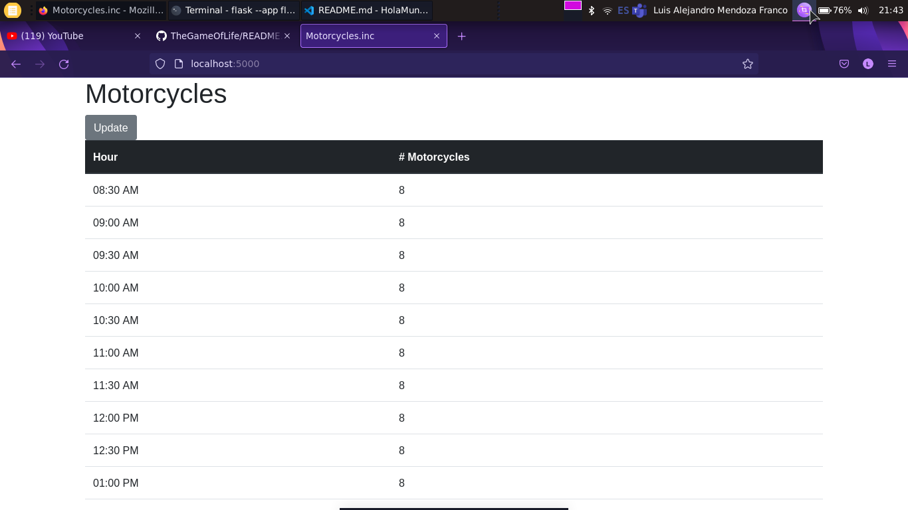
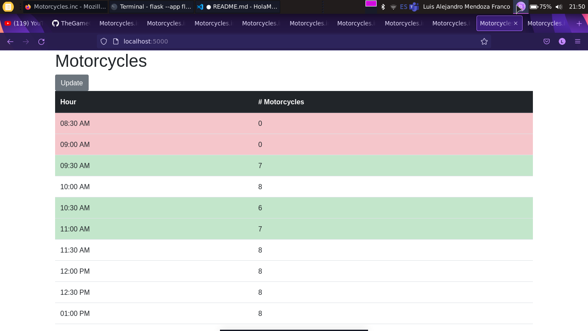

# Lista de tramos horarios (Ejercicio de HolaMundo)

Esta es una aplicación elaborada a partir del video para construir un portafolio del canal de Youtube [HolaMundo](https://www.youtube.com/c/HolaMundoDev). El video es [Construye un portafolio de desarrollo | yo reaccionaré a tu código](https://youtu.be/psSO3T7gslU)

## Instruciones

1. Construye una lista que contenga tramos horarios en intervalos de 30 minutos que comience desde las 8:00 y termine hasta las 8:00 pm. Por ejemplo: 8:00, 8:30, 9:00, ..., 20:00.
2. La empresa tiene una disponibilidad de 8 motociclistas cada 30 minutos. Cuando alguien haga clic sobre un intervalo deberá tomar un recurso de motociclista, además de marcar la caja en verde. Al volver a dar clic debe liberar el recurso. Si otros usuarios ya han tomado todos los motociclistas la caja debe aparecer en color rojo y no debe permitir tomar ese horario.
3. Extra: Realizarlo en 1 hora.

## Implementación

Aplicación implementada en Python con el framework Flask y Bootstrap (utilizando CDN). La aplicación te recibe con la siguiente página principal:



Se puede dar `click` en algun horario para que el usuario reserve dicho horario y recurso. Al dar `click` se sobrea esa fila de color verde, al volver a dar `click` se libera el recurso para otros usuarios. Cuando ya no hay recursos en un horario y otros usuarios tienen ese recurso, la fila se sombrea de rojo. Se puede precionar el boton `update` para actualizar la tabla y ver como otros usuarios la han modificado. Para simular varios usuarios se abren varias ventanas.



## Instalación

Los requisitos e instrucciones se especifian a continuación.

### Requisitos
- Python 3

### Clonación e instalación

Descarga el proyecto como un `zip` o clonalo con el siguiente comando:
```bash
git clone https://github.com/luis-ale-117/ListaTramosHorarios.git
```
Dentro de la carpeta del proyecto virtualiza el entorno de trabajo con el comando:

```bash
python3 -m venv venv
```
Una vez que se tenga el entorno virtualizado, activalo con el siguiente comando (para Linux):
```bash
source venv/bin/activate
```
Después de activar el entorno, instala los paquetes necesarios para el proyecto con el siguiente comando (este comando instalará Flask):
```bash
pip install -r requirements.txt
```
Finalmente, ejecuta el proyecto con el comando:

```bash
flask --app flaskr --debug run
```
Este iniciará un servidor HTTP localmente en el puerto 5000, para ver el proyecto en un navegador escribe la URL [http://localhost:5000](http://localhost:5000)

Para detener el servidor HTTP local que corre la aplicación en la terminal use `ctrl-c`. Para desactivar el entorno virtual simplemente ejecute:
```bash
deactivate
```

## License

Vea el archivo [LICENSE](/LICENSE) para conocer los derechos y limitaciones.